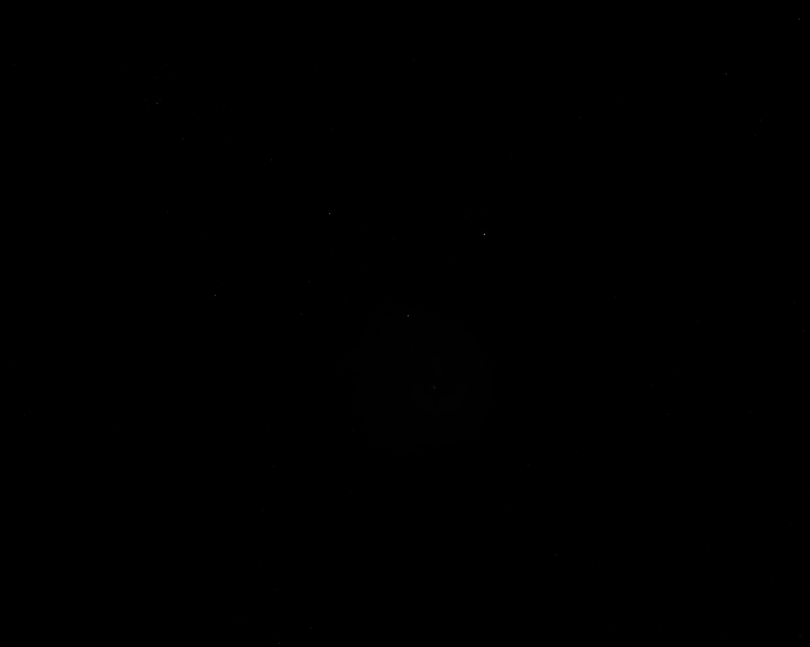
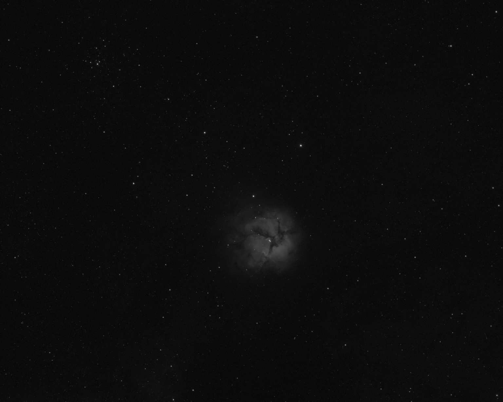
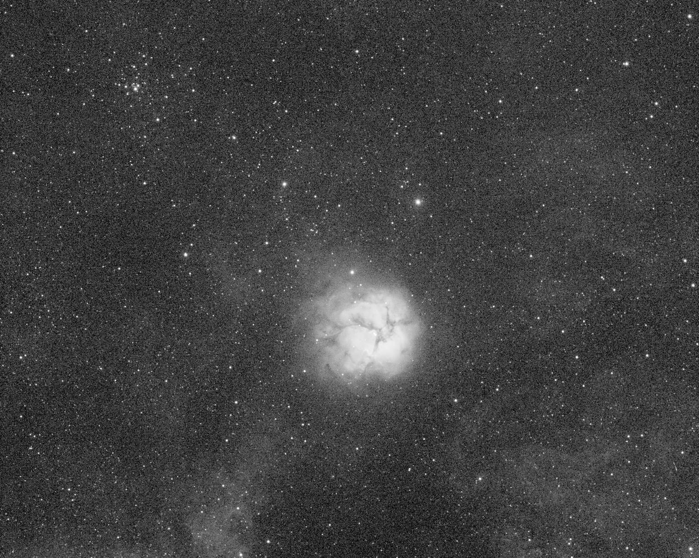

# Auto Stretch

Automatically stretch astronomical images in numpy array format. Useful for creating easy-to-see, non-linear jpgs from fits files. 

linear (no stretch) | arcsin stretch | auto-stretch (using this library)
:-:|:-:|:-:
 |  | 

## Installation

`$ pip install auto-stretch`

## Usage

The stretch function operates on numpy arrays. Example use:

```python
import numpy as np
import astropy
from auto_stretch.stretch import Stretch

image = np.array([[1,2],[3,1]])
stretched_image = Stretch().stretch(image)
print(stretched_image)

# output:
# [[0.13824057 0.51318458]
# [1.         0.13824057]]
```
