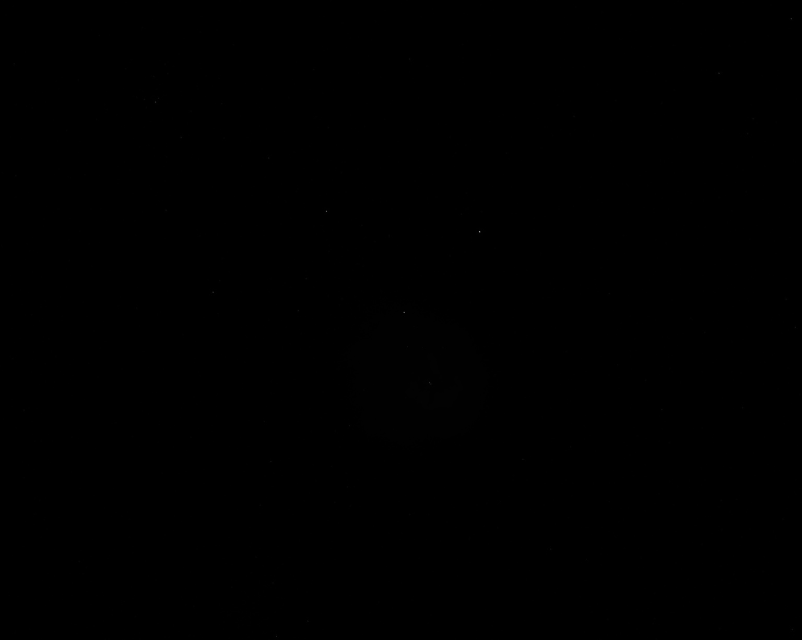
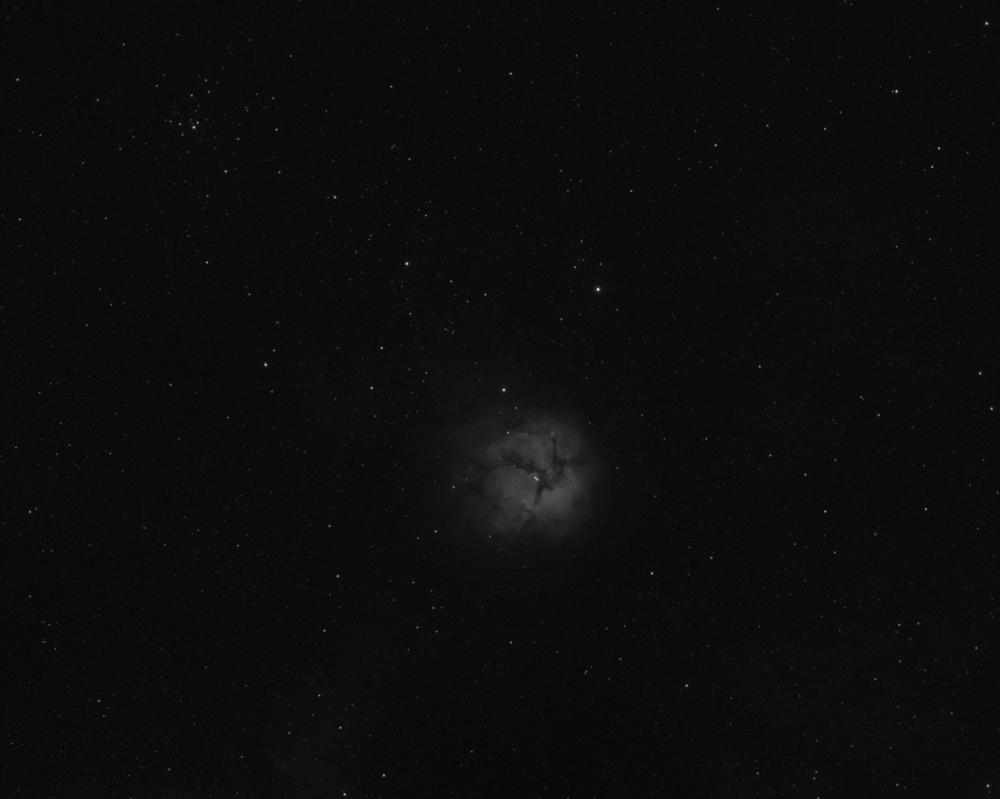
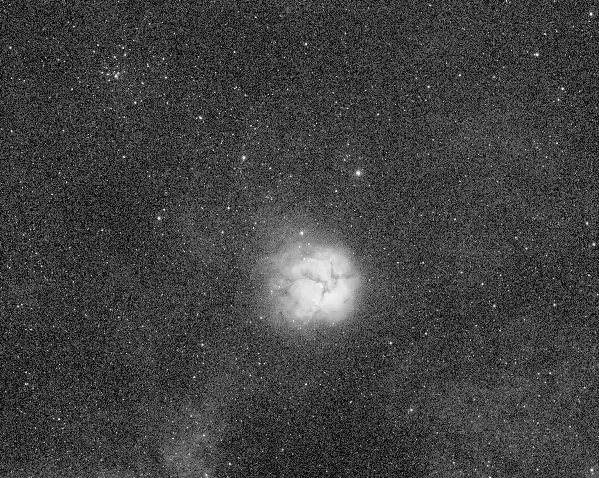

# Auto Stretch

Automatically stretch linear astronomical images for easy visualization.

[](https://pypi.org/project/auto-stretch/)
[](https://pypi.org/project/auto-stretch/)
[](https://github.com/timbeccue/auto_stretch/actions/workflows/ci.yml)
[](LICENSE)

Auto Stretch applies a PixInsight-style Screen Transfer Function (STF) midtones transfer to linear astronomical images stored as numpy arrays. It automatically computes the optimal stretch parameters from the image data so that faint detail becomes visible without manual histogram adjustment.

linear (no stretch) | arcsin stretch | auto-stretch (using this library)
:-:|:-:|:-:
 |  | 

## Installation

```
pip install auto-stretch
```

## Quickstart

```python
import numpy as np
from auto_stretch import apply_stretch, Stretch

image = np.array([[0.1, 0.25], [0.8, 0.3]], dtype=np.float64)

stretched = apply_stretch(image)
# or with custom parameters:
stretched = Stretch(target_bkg=0.25, shadows_clip=-1.25).stretch(image)
```

## Input contract

- Input must be a 2D numpy array. 1D and 3D arrays raise `ValueError`.
- Input is coerced to float64 internally; the caller's array is never mutated.
- NaN pixels propagate through the stretch unchanged.
- Output is float64 with values clamped to `[0, 1]`.

## Parameters

| Parameter | Default | Description |
|-----------|---------|-------------|
| `target_bkg` | 0.25 | Target median brightness after stretch |
| `shadows_clip` | -1.25 | Shadow clipping point in units of median absolute deviation below the median |

The underlying algorithm follows the [PixInsight Histogram Transformation STF](https://pixinsight.com/doc/tools/HistogramTransformation/HistogramTransformation.html) method.

## Dependencies

- Python >= 3.10
- numpy >= 1.20

## Credit

Based on the [PixInsight Screen Transfer Function (STF)](https://pixinsight.com/doc/tools/HistogramTransformation/HistogramTransformation.html) algorithm developed by Pleiades Astrophoto.

## License

MIT — see [LICENSE](LICENSE).
